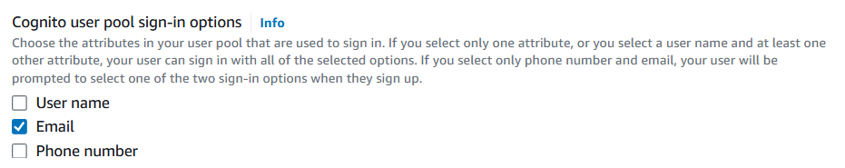
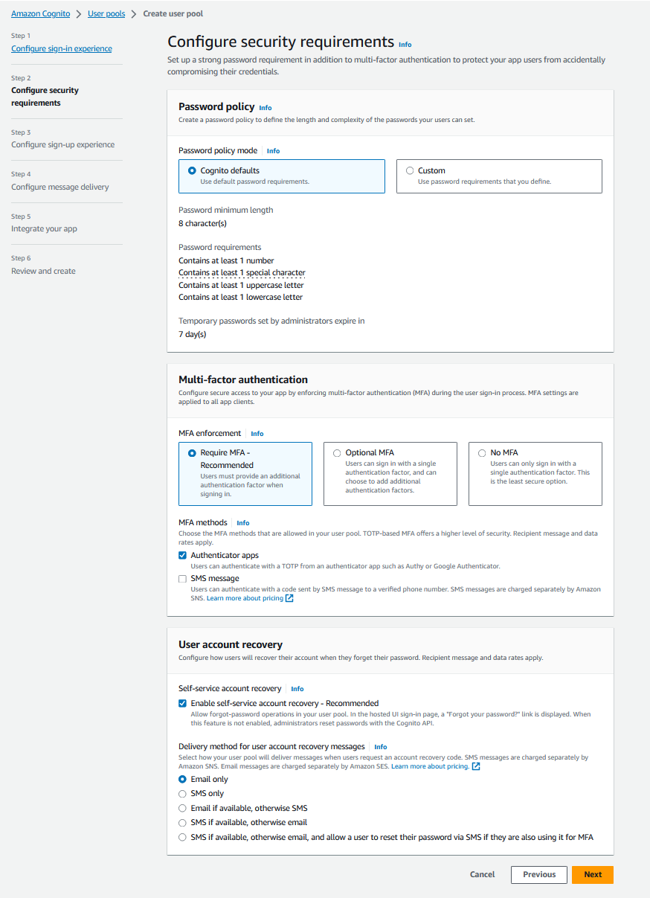
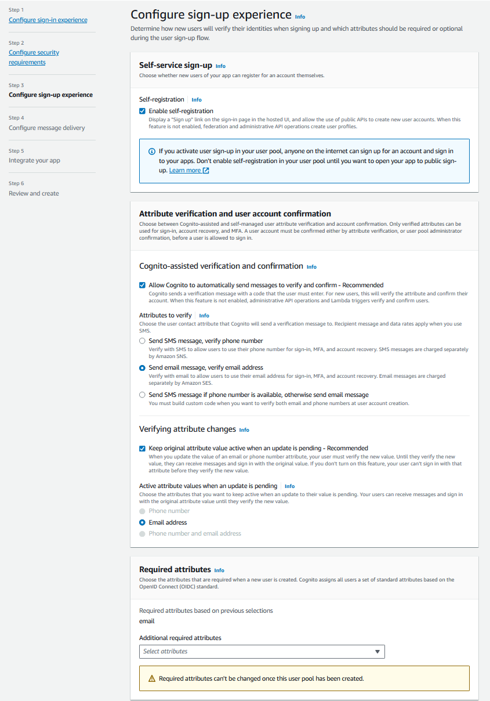
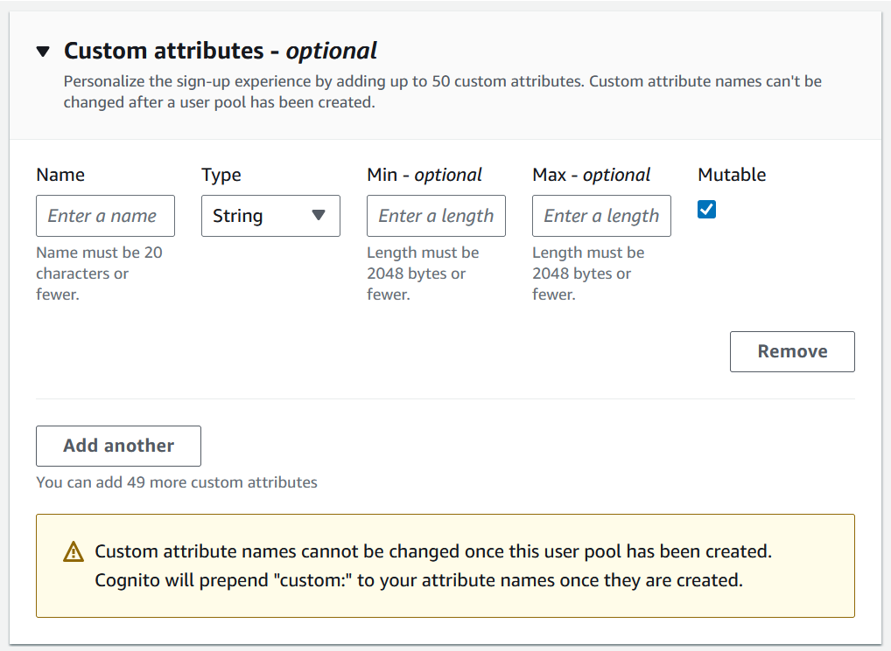
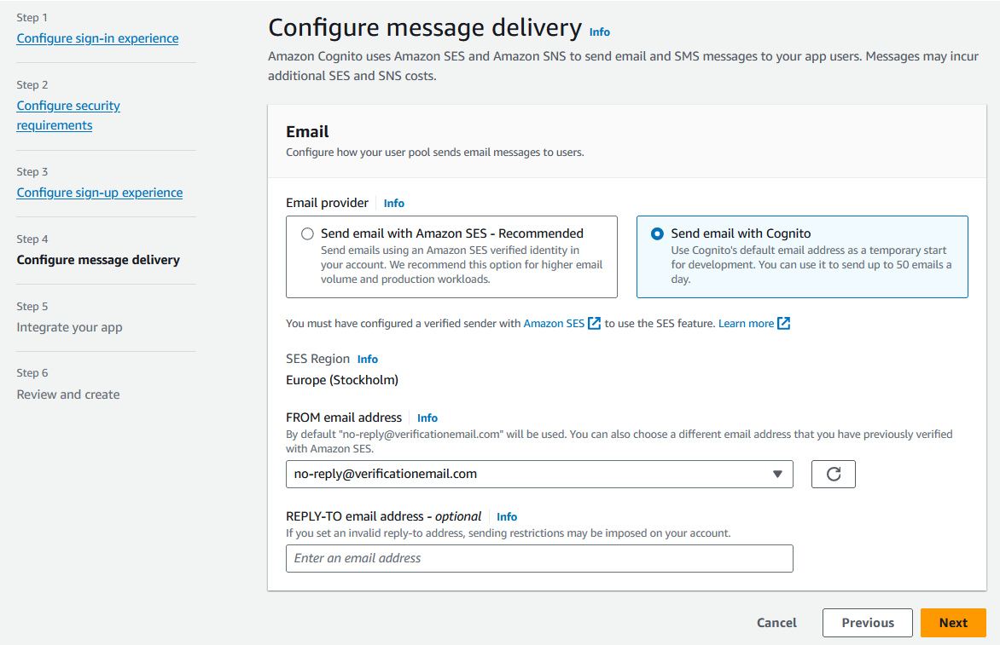
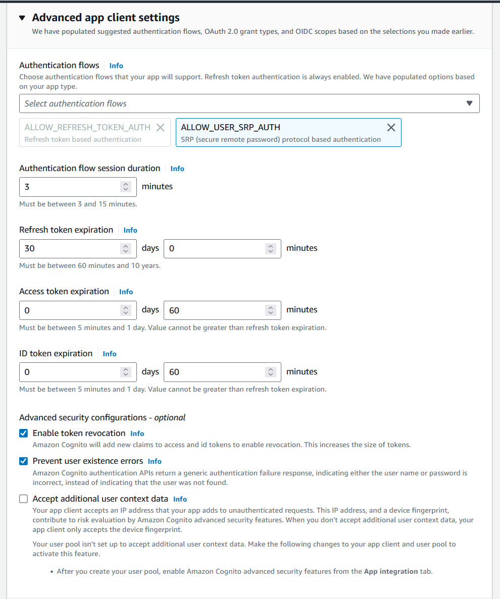
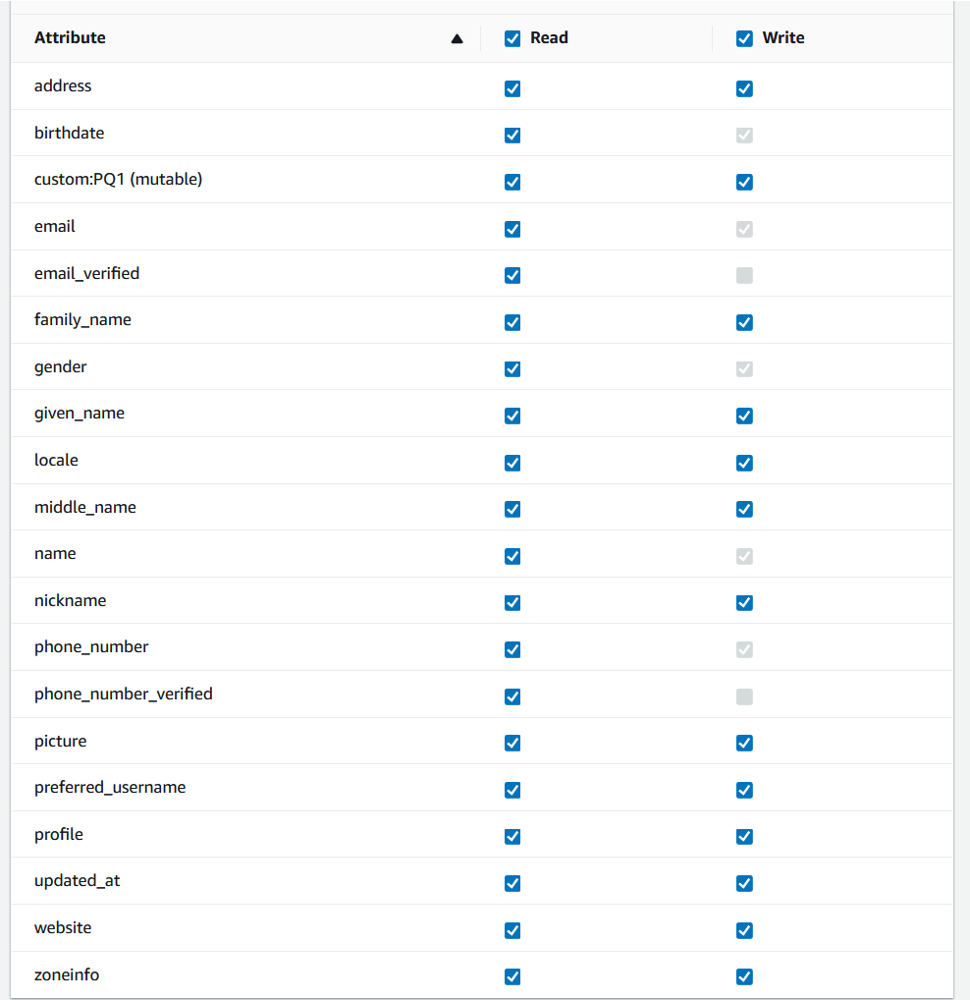

Its honestly quit straightforward in the manual but a few notes: 
  
Step 1  
Make sure to only enable email as signin options because phone/sms has costs associates 

  

Step 2  

Step 3  
Again make sure there's no sms messages being sent as part of the flow 

User profile possible attributes for additional required attributes :
- Address
- Birthdate
- Family name
- Gender
- Given name
- Full name 
- Phone number
- Locale
- Middle name
- Nickname
- Picture
- Preferred username
- Profile (URL)
- Updated_at
- Website (webpage)
- (Time)zoneinfo
- custom attributes 

you can add custom attributes
Might be a good way to implement the extra functionality (personal questions)

Step 4  

Step 5  
Uncheck 'use the cognito hosted UI' 
Uncheck 'generate a client secret' !! At the moment this not supported using the javascript SDK 
- Advanced authentication settings

- attribute read and write permissions

Step 6  
Review everything and click 'create user pool'
