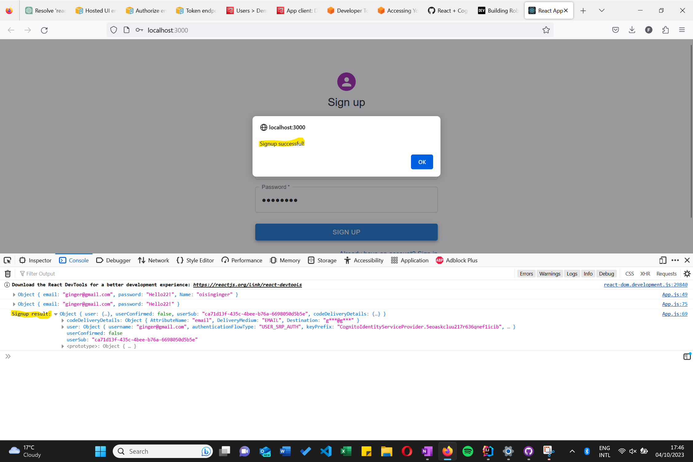
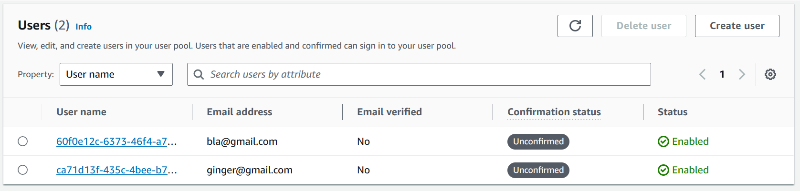

**step 0**

Update node.js and npm (lol)

**step 1**

npm install amazon-cognito-identity-js

**Step 2**
I created an example for a signup form. There are similar other functions available for this react component. Use the following code for your sign up form
    
    import { CognitoUserPool } from 'amazon-cognito-identity-js';
    
    const poolData = {
    UserPoolId: 'eu-north-1_ItPdvWwXq',
    ClientId: '5eoaskcluu217r636qnef1icib',
    };
    const userPool = new CognitoUserPool(poolData);
    
    const handleSubmit = (event) => {
        event.preventDefault();

        const data = new FormData(event.currentTarget);
        console.log({
            email: data.get('email'),
            password: data.get('password'),
            Name: data.get('firstName') + data.get('lastName'),
        });

        userPool.signUp(
            data.get('email'),
            data.get('password'),
            [
                { Name: 'name', Value: data.get('firstName') + data.get('lastName') },
            ],
            null,
            (err, result) => {
                // Unsuccesfull signup
                if (err) {
                    setError(err.message);
                    return;
                }
            // Successful signup
            console.log('Signup result:', result);
            alert('Signup successful!');
            }
        );

        //for error checking
        console.log({
            email: data.get('email'),
            password: data.get('password'),
        });
    };

And Voila these are the results: 

and in the cognito aws console:

To find other functionalities for the CognitoUserPool react component, here are some sources:
- https://aws.amazon.com/blogs/mobile/accessing-your-user-pools-using-the-amazon-cognito-identity-sdk-for-javascript/
- https://dev.to/aws-builders/building-robust-user-sign-up-with-aws-cognito-and-react-cfd
- https://gist.github.com/gabeweaver/d1be9f0d41069437f576c375c30e134c
- General amazon cognito documentation: https://docs.aws.amazon.com/cognito/latest/developerguide/what-is-amazon-cognito.html
- Google (sorry Brendan) or chatgpt 
