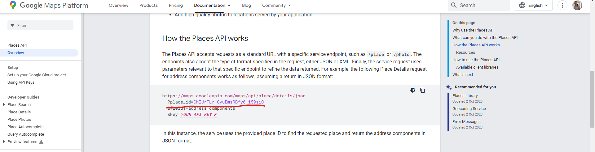
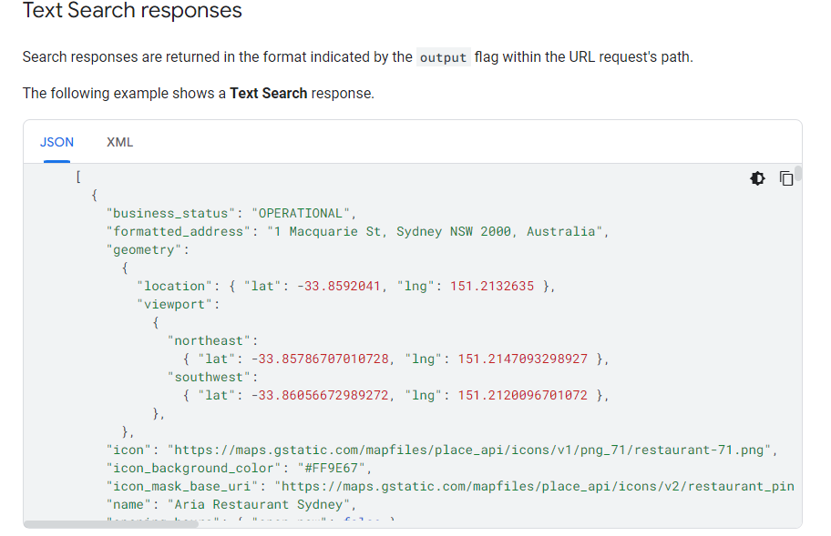

# Limitations on how we can use the google Maps API

## Caching Relevant Sections
https://developers.google.com/maps/terms-20180207#10.-license-restrictions.
Restrictions on your Maps API Implementations.
- No creation of a substitute service. You will not use the Service to create a Maps API Implementation that is a substitute for, or substantially similar service to, Google Maps (at https://www.google.com/maps (or such other URL as Google may provide)) ("Google Maps") or the Service.
- No creation or augmentation of data sets based on Google’s Content or Services. You will not use Google’s Content or Services to create or augment your own mapping-related dataset (or that of a third party), including a mapping or navigation dataset, business listings database, mailing list, or telemarketing list.
- No navigation. You will not use the Service or Content for or in connection with (a) real-time navigation or route guidance; or (b) automatic or autonomous vehicle control.
- No asset-tracking unless you have purchased the applicable enterprise license. Unless you have purchased an applicable Premium Plan or Maps APIs for Work license that expressly permits you to do so, you will not use the Service or Content for commercial asset-tracking or in Maps API Implementations whose primary purpose is to assess vehicle insurance risks.
    - Commercial asset-tracking includes dispatch, fleet management, and Maps API Implementations that track your (or your end users’) assets (for example, private or commercial transportation applications, including taxi and vehicle-for-hire applications).
    - Non-commercial asset-tracking implementations include applications used for a non-commercial purpose (for example, a free, publicly accessible Maps API Implementation that displays real-time public transit or other transportation status information or that allows end users to share real-time location with others).
- No use of Content in a listings service. You will not use business listings-related Content in any Customer Implementation that has the primary purpose of making available business, residential address, or telephone directory listings.
- No use of Content for an Ads product. You will not use business listings-related Content to create or augment an advertising product.

https://cloud.google.com/maps-platform/terms/maps-service-terms
- **Geocoding API**
The following terms apply only to the Geocoding API:
    -  Use without a Google Map. Customer may use Google Maps Content from the Geocoding API in Customer Applications without a corresponding Google Map.
    - Attribution Requirements. Customer must provide Google with attribution, in accordance with the Documentation, if Customer uses Google Maps Content from the Geocoding API without a corresponding Google Map.
    - No use with a non-Google map. Customer must not use Google Maps Content from the Geocoding API in conjunction with a non-Google map.
    - Caching. Customer can temporarily cache latitude (lat) and longitude (lng) values from the Geocoding API for up to 30 consecutive calendar days, after which Customer must delete the cached latitude and longitude values. Customer can cache Geocoding API Place ID (place_id) values, in accordance with the Geocoding API Policies.

- **Geolocation API**
The following terms apply only to the Geolocation API:
    - Use without a Google Map. Customer may use Google Maps Content from the Geolocation API in Customer Applications without a corresponding Google Map.
    - Attribution Requirements. Customer must provide Google with attribution, in accordance with the Documentation, if Customer uses Google Maps Content from the Geolocation API without a corresponding Google Map.
    - No use with a non-Google map. Customer must not use Google Maps Content from the Geolocation API in conjunction with a non-Google map.
    - Caching. Customer can temporarily cache latitude (lat) and longitude (lng) values from the Geolocation API for up to 30 consecutive calendar days, after which Customer must delete the cached latitude and longitude values.

- **Places API**
The following terms apply only to the Places API:
    - Use without a Google Map. Customer may use Google Maps Content from the Places API in Customer Applications without a corresponding Google Map.
    - Attribution Requirements. Customer must provide Google with attribution, in accordance with the Documentation, if Customer uses Google Maps Content from the Places API without a corresponding Google Map.
    - No use with a non-Google map. Customer must not use Google Maps Content from the Places API in conjunction with a non-Google map.
    - Caching. Customer can temporarily cache latitude (lat) and longitude (lng) values from the Places API for up to 30 consecutive calendar days, after which Customer must delete the cached latitude and longitude values. Customer can cache Places API Place ID (place_id) values, in accordance with the Places API Policies.

### What this means for us
We cannot cache the google maps data for all properties, however, we can temporarily store geocoding (lat/long) for 30 days. It also appears from the docs that we can cache the place id's indefinitely (see Places API caching). This means that our property data listings can include the place id's for nearby places. 

#### Recommendation System:
- We can cache the data long enough to score the rental listings. 
    - Example: We can cache restaurants in Baltimore in our own restaurants table. Then when we are processing the property data from the Zillow API, we can give it a 'restaurants nearby' scoring, by comparing the distance between the listing and the restaurants using each ones lat/long. We can also save place id's into a field on the property as: nearby restaurants.

#### Frontend + Backend:
- We cannot store and share the geolocation data from google (i.e the restaurants names, lat/long, etc.), however, we can store the place id, and we can categorize them. E.g. we can store all the restaurant place id's in a Restaurants Table, and all the coffee shop place id's in a Coffee Shops table. We can then use the google maps API on the frontend using the place id's to get the geo coordinates. We can then use the embedded Google Maps component to visualize the location.

## Our Terms of Service + Privacy Policy
We also need to provide users information that they are agreeing to the google maps TOS and Privacy policy:
**Providing terms of use and privacy policy**
- If you develop a Places API application, you must make available the Terms of Use and a Privacy Policy with your application which meets the guidelines outlined in your Agreement with Google:
    - The Terms of Use and Privacy Policy must be publicly available.
    - You must explicitly state in your application's Terms of Use that by using your application, users are bound by Google’s Terms of Service.
    - You must notify users in your Privacy Policy that you are using the Google Maps API(s) and incorporate by reference the Google Privacy Policy.
- The recommended place to make available your Terms of Use and Privacy Policy depends upon your application's platform.